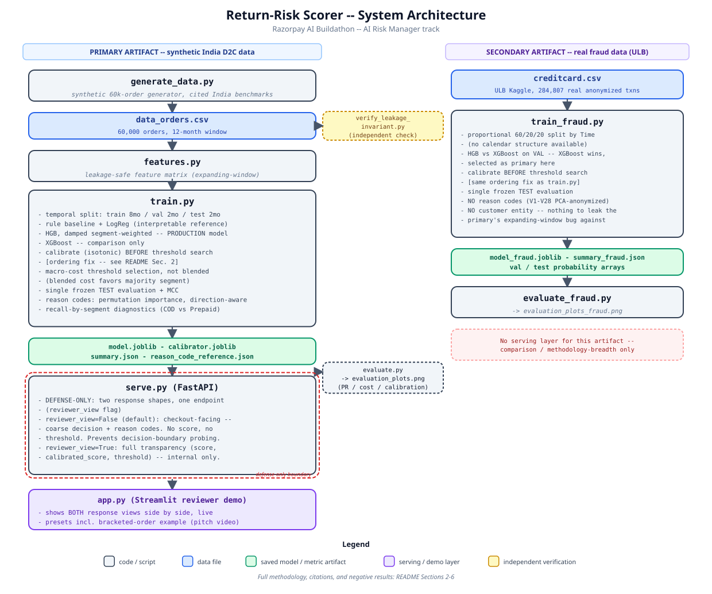

# ReturnGuard - Return/RTO Risk Scorer for Indian E-Commerce

**Razorpay AI Buildathon - AI Risk Manager track**

A verifier, not an auto-blocker: scores each e-commerce order for return/RTO risk at time of placement so a downstream policy (address confirmation, prepaid nudge, priority QC) can intervene before the order ships. Never auto-rejects an order. See [Section 4 Defense-Only Statement](#4-defense-only-statement).

---

## Table of Contents
1. [Results](#1-results)
2. [Methodology](#2-methodology)
3. [Data Calibration & Citations](#3-data-calibration--citations)
4. [Defense-Only Statement](#4-defense-only-statement)
5. [What We Tried and Rejected](#5-what-we-tried-and-rejected)
6. [Known Limitations](#6-known-limitations)
7. [External Validation](#7-external-validation)
8. [Setup & Reproduction](#8-setup--reproduction)
9. [References](#9-references)

---

## 1. Results

### Primary artifact - Return-Risk Scorer (synthetic India D2C data, 60k orders)

Held out, touched once, on the final production model (damped segment-weighted HistGradientBoostingClassifier, now including `product_past_return_rate` - see [Section 3.10](#section-310-listing-level-return-rate-feature) and [Section 5](#5-what-we-tried-and-rejected)):

| Metric | Value |
|---|---|
| Precision | 0.281 |
| Recall | 0.885 |
| F1 | 0.426 |
| PR-AUC | 0.493 |
| ROC-AUC | 0.818 |
| MCC | 0.324 |
| Confusion matrix | TN=4,605 · FP=3,744 · FN=190 · TP=1,461 |
| Decision threshold | 0.115 (calibrated scale - see [Section 2](#2-methodology)) |
| Cost at threshold | ₹127,800 |
| Cost if flagging nothing | ₹297,180 |
| **Cost reduction vs. flagging nothing** | **57.0%** |
| Brier score (raw → calibrated) | 0.1115 → 0.1091 |

**Recall by segment** (the number that actually answers "does this catch prepaid returns," see [Section 5](#5-what-we-tried-and-rejected)):

| Segment | Recall |
|---|---|
| COD | 0.948 (1,345 / 1,419) |
| Prepaid | 0.500 (116 / 232) |

This table reflects two changes together, not one: a data-generation bug fix (COD:Prepaid ratio had drifted to 5.7x after the listing-feature noise term was added; corrected back to 7.21x, within the cited 6.4–7.6x band) and the newly adopted `product_past_return_rate` feature. **The Prepaid recall improvement (0.394→0.500 vs. the previous frozen numbers) is attributed specifically to the feature**, not this table - that claim rests on a controlled paired 8-seed ablation (same dataset, same seeds, feature on/off) that isolated the feature's effect independent of the data fix; see [Section 5](#5-what-we-tried-and-rejected) for that evidence. Cost is roughly flat versus the previous frozen run (₹127,800 vs. ₹127,405) - this is reported plainly rather than framed as a win, since two confounded changes make a clean cost attribution impossible from this table alone. The COD recall dip (0.975→0.948) is the expected effect of macro-cost threshold reallocation once Prepaid became more separable - COD had recall to spare, Prepaid didn't - not a regression in COD's own discriminative power.

This asymmetry is real, understood, and discussed honestly in [Section 6](#6-known-limitations) - it is not hidden or explained away.

(Outputs/evaluation_plots.png)
*(Plot: `Outputs/evaluation_plots.png` - precision-recall curve, cost-vs-threshold curve, calibration reliability diagram)*

### Secondary artifact - Fraud detector (real data: ULB `creditcard.csv`, 284,807 transactions)

Built to demonstrate the same evaluation discipline (temporal split, cost-sensitive threshold on VAL only, single frozen TEST pass, calibration) on genuinely real transaction data, since no India-specific COD-granular public dataset exists ([Section 6](#6-known-limitations), [Section 9, ref 31](#9-references)).

| Metric | Value |
|---|---|
| Precision | 0.611 |
| Recall | 0.773 |
| F1 | 0.682 |
| PR-AUC | 0.782 |
| ROC-AUC | 0.970 |
| Confusion matrix | TN=56,850 · FP=37 · FN=17 · TP=58 |
| Cost reduction vs. flagging nothing | 75.3% |
| Primary model | XGBoost (beat HGB on VAL PR-AUC: 0.774 vs 0.727) |

Costs are USD-scale placeholders derived from the dataset's own `Amount` field - **not INR, not comparable to the primary artifact's cost figures.** No reason codes are produced (features are PCA-anonymized, not human-interpretable). Full caveats in [Section 6](#6-known-limitations).

---

## 2. Methodology



1. **Data.** Synthetic India D2C order data (60,000 orders, 12-month window), generated by a documented generative model calibrated to publicly reported India return/RTO benchmarks - chosen because no auth-free public dataset exists with India-specific COD-granular return data ([Section 3](#3-data-calibration--citations), [Section 9, refs 31-32](#9-references)).
2. **Leakage-safe features.** `customer_past_return_rate` / `customer_prior_orders` and `product_past_return_rate` are computed as an expanding window in time order (only orders strictly before the current one, per customer or per listing). Independently re-verified against stored values (0 mismatches for both). Demonstrated live: violating this invariant inflates PR-AUC from 0.311 to 0.743 on the same test set (`leakage_demo.py`).
3. **Temporal split.** Train (8mo) / Val (2mo) / Test (2mo) by `order_date`, never random - a random split would leak future customer behavior into training.
4. **Model.** HistGradientBoostingClassifier (primary), trained with damped segment-weighted sample weights (bucket-balanced across `payment_mode × returned`, exponent 0.3) - reduces missed prepaid returns relative to an unweighted baseline at a small cost increase. LogisticRegression and XGBoost trained alongside as interpretable/comparison references.
5. **Threshold selection & calibration.** Threshold chosen via macro-cost grid search (mean of COD and Prepaid cost-per-order, not blended total - blended cost systematically favors the majority segment by volume). Isotonic calibration is fit **before** threshold selection, and the threshold is searched on calibrated probabilities - this ordering was a real bug we found and fixed mid-project (previously calibration was fit after the search, so the decision threshold and the probability shown in the demo were on different scales). The macro-searched threshold (0.110) was validated against the closed-form cost-optimal threshold for well-calibrated probabilities, `COST_FP/(COST_FP+COST_FN) = 0.122` - the two are close, supporting that the fix worked.
6. **Serving & reason codes.** FastAPI service (`serve.py`) with a two-tier response controlled by `reviewer_view` - see [Section 4](#4-defense-only-statement). Reason codes are permutation-importance-ranked, direction-aware (does this order's value sit on the risk-elevating side of the training midpoint), not SHAP - deliberately coarse, FICO-adverse-action-code style, not a raw model-internals dump.

---

## 3. Data Calibration & Citations

Every generative-model assumption is documented in `generate_data.py` as inline comments and cross-referenced here. Full source list in [Section 9](#9-references); source-quality tiering also in [Section 9](#9-references).

### Section 3.1 COD vs. Prepaid return/RTO rate
Modeled at a 6.4–7.6x COD:Prepaid ratio, a conservative midpoint - cited sources disagree substantially by report/season/category (COD RTO reported 21–58% across sources) [9-1,5,6,7,9,10]. `COD_COEF` was recalibrated when the bracketing feature was added, to hold this ratio inside the cited band despite the new prepaid-side effect (see [Section 3.2](#section-32-bracketing-feature)). **Recalibrated a second time** when the listing-level heterogeneity feature's noise term temporarily compressed the ratio to 5.7x via a Jensen's-inequality effect on the sigmoid; corrected back to 7.21x through iterative, empirically-verified adjustment of `COD_COEF` and the base intercept - full bug and fix writeup in [Section 3.10](#section-310-listing-level-return-rate-feature).

### Section 3.2 Bracketing feature
`is_bracketed` / `size_variant_count`, modeled as an apparel×prepaid interaction (mechanism: COD buyers can reject unwanted variants at the doorstep without pre-committing financially; prepaid buyers must pay upfront, making multi-size ordering-and-returning the rational hedge). Bracket rate calibrated to ~63% among the eligible segment (apparel+prepaid specifically, not a population-wide transplant), anchored to Loop Returns' population figure [9-23]. Corroborated by a second, independent mechanism source: GoKwik traces 60–70% of RTOs to buying psychology rather than logistics [9-7].

### Section 3.3 Category-level return rates
Graded per-category risk term (replacing a binary apparel flag), derived from India-specific citations [9-7,21,22,26] with TrackVid used for Footwear where no India-specific figure was found [9-23]. Fashion, Footwear, and Grocery land within cited ranges without further tuning; Beauty, Home, and Electronics land 3–5 points below their cited floor - traced to two identified interaction effects (Electronics' typical price falling outside the price-hump term's range; Fashion/Footwear's disproportionate COD-selection stacking additional COD-specific bonuses). An attempted iterative correction did not converge (six category terms sharing one intercept oscillate rather than settle) and was deliberately abandoned rather than forced - documented as a known limitation, not resolved. **Beauty specifically is left uncalibrated toward either end**: First Resort/ClickPost/Base Blog cite 18–25%, while Eightx/Richpanel/TrackVid (largely global data) cite 4–12% [9-7,21,26,27,28,35,37].

### Section 3.4 Price-band and delivery-speed effects
Non-monotonic price "hump" (highest RTO at ₹500–1,000) and delivery-speed bands (22%/27%/35% RTO at 1–2 / 3–5 / 5+ days), both from Shipway ShipNotes FY25, corroborated independently by First Resort [9-1,2,7,11]. Delivery-speed direction cross-checked against an academic Western-market study (Masuch, Landwehr & Flath, *Journal of Retailing* 2024) as an order-of-magnitude sanity check only, not a direct calibration target [9-12,13,14].

### Section 3.5 Discount effect on returns
**Corrected mid-project**: the original assumption (higher discount → higher return, "impulse buy" framing) was found to have the **wrong sign**. Both the Masuch/Landwehr/Flath paper and a dedicated at-purchase-vs-post-purchase-discount study found at-purchase discounts have a **negative** effect on return likelihood [9-12,20]. Magnitude was back-solved from a probability-scale marginal effect (–.0127, p=.004, ~0.3pp effect over a 25pp discount for the most price-sensitive segment) [9-20], replacing an originally ten-times-too-large coefficient.

### Section 3.6 Cost assumptions
`COST_FN = ₹180` (RTO/reverse-logistics cost), within the ₹180–240 cited range [9-1,10,15,16]. `COST_FP = ₹25`, composed of a cited mechanical verification cost (~₹8, Caller Digital) [9-17,18,19] plus an estimated ₹17 friction/opportunity-cost premium - **this second component is an unresearched assumption, stated as such, not a cited figure.**

**Revisited in a later research pass** (mirroring the COST_FN bottom-up methodology): independent Tier-2 India BPO and AI-voice-bot per-call cost estimates (₹7–13 per connected call; ₹8–25 per verified COD order) converge with the original Caller Digital figure rather than diverging from it [9-47,48,49]. This places ₹25 at the *top* of the cited mechanical range, not below it - the same "more rigorous estimate converges instead of diverging" pattern seen when COST_FN was researched. Conclusion: do not lower COST_FP; the mechanical component alone already justifies close to the current value, before any friction/goodwill premium is added. This research was prompted by, and is discussed alongside, a tiered-FP-intervention idea that it ultimately helped rule out - see [Section 5](#5-what-we-tried-and-rejected).

### Section 3.7 Customer-base scaling defensibility
Proportional customer scaling (2.73 orders/customer/year at 60k orders) validated against Frameleads' India D2C benchmark of 2.5–4x/year as "healthy" repeat-purchase frequency [9-42,43]. A 350k-order scale-up experiment testing proportional vs. fixed-customer-count scaling found proportional scaling wins on both realism and empirical grounds - see [Section 5](#5-what-we-tried-and-rejected).

### Section 3.8 Serial-returner effect
`customer_past_return_rate` layered as a serial-returner boost, informed by Signifyd's finding that ~11% of shoppers qualify as serial returners with 40–50%+ return rates [9-28,29,30].

### Section 3.9 Festive-period effect
`is_festive`, a general (not COD-specific) return-rate boost during known recurring Indian e-commerce sale windows (Independence Day, Diwali/Big Billion Days, Year-End, Republic Day, mid-year EORS). Calibrated conservatively against TrackVid's report that returns "can climb to 40% for some sellers" during festive sales [9-23] - treated as an upper bound for some sellers, not a population average or a target. Actual simulated uplift landed at 18.8% festive vs. 15.3% normal (~1.23x). Applied as a general effect rather than COD-specific, since the cited mechanism (impulse buying during flash sales) plausibly affects post-delivery prepaid regret too, and no source segmented this by payment mode. Window dates are approximate (coarse 10-25 day ranges), not verified against exact historical sale dates.

### Section 3.10 Listing-level return-rate feature
`product_past_return_rate`, targeting the missing-feature ceiling identified in [Section 6](#6-known-limitations): category-level risk terms can't capture within-category variance driven by an individual listing's fit, sizing, or material quality. Modeled the same way as `customer_past_return_rate` - a hidden per-listing logit offset (`_listing_quality_effect`, `N(0, 0.8)`, uncited, hand-picked assumption) drives the true return probability, and the model only ever sees an expanding-window historical proxy computed from it (min. 3 prior orders before trusting the listing's own rate, else a 0.16 cold-start prior). Unlike the customer feature, this one has **no feedback loop** into the generative probability - it is a pure observable proxy of an already-latent cause, not a second causal channel. `N_LISTINGS_PER_CATEGORY = 80` is also an uncited, hand-picked assumption, chosen to give each listing enough order volume (~125 orders/listing at 60k total orders) for the expanding average to be informative within the project's timeframe.

**Bug found and fixed during implementation, not swept under the rug**: adding a mean-zero Gaussian noise term directly into the logit is not mean-zero in probability space. By Jensen's inequality, `E[sigmoid(x + noise)] > sigmoid(x)` whenever `x` sits in the convex region of the sigmoid (true for any negative logit, which describes every segment here), and the inflation is proportionally larger the more negative (deeper-tail) `x` is. This produced two independent, measurable symptoms: (1) overall return rate rose from ~16% to 17.9-18.2% across two intermediate regenerations, and (2) the COD:Prepaid ratio compressed from the previously-validated ~7x down to 5.7x, because Prepaid's much lower baseline probability (~5%) sits deeper in the convex region than COD's (~28-30%) and was inflated proportionally more by the same noise term. This is the same class of bug as the category-risk shared-intercept over-constraint documented in [Section 3.3](#section-33-category-level-return-rates) - an additive term that looked neutral on paper was not neutral after the logit transform - now observed a second time in this project, worth flagging as a recurring failure mode of this generative architecture rather than a one-off mistake.

**Fix: iterative, empirically-verified recalibration, not a closed-form correction** (no closed form exists for the expectation of a sigmoid of a Gaussian-perturbed logit). Reasoned about direction and which lever to move - the intercept affects both segments, `COD_COEF` affects only COD, so raising `COD_COEF` by X while lowering the intercept by the same X cancels COD's net change while still reducing Prepaid's - then verified against real regenerated output at each step rather than trusting the algebra alone. Three rounds: intercept -4.50→-4.65 (fixed overall rate, did not fix ratio, as expected since a flat shift can't correct a between-segment distortion), `COD_COEF` 2.40→2.55 with intercept→-4.85 (partial ratio recovery, overshot overall rate to 17.9%), `COD_COEF`→2.75 with intercept→-4.95 (final: overall rate 16.32% at generation time / 16.51% on the frozen test split, COD:Prepaid ratio 7.21x). Final constants (`LISTING_QUALITY_SIGMA=0.8`, `COD_COEF=2.75`, intercept=-4.95) are hand-tuned to hit previously-cited targets, not independently cited themselves - same treatment as the bracketing and festive-period constants elsewhere in this section.

**Result, evidenced three independent ways**: (1) a leakage self-check on the new column recomputed independently from scratch, 0 mismatches against stored values; (2) a stratified check confirming the column's high full-history match rate at high prior-order-counts is legitimate expanding-window convergence (3.9% match at <10 prior orders, rising monotonically to 49.4% at 60+) rather than a leak, since a genuine leak would show uniformly high match regardless of prior-order-count; (3) a paired 8-seed ablation (same seed trains a model with and without the feature, same data, same everything else, isolating the feature's effect from the training-noise problem documented in [Section 5](#5-what-we-tried-and-rejected)) found a mean Prepaid recall improvement of +0.120, SE 0.018 (diff/SE = 6.60), positive in 8/8 seeds. Adopted into production - see [Section 5](#5-what-we-tried-and-rejected) for the full ablation writeup and [Section 1](#1-results) for the resulting frozen numbers.

---

## 4. Defense-Only Statement

This system is a **verifier, not an auto-blocker**. It never auto-rejects an order. The scoring service (`serve.py`) returns two different response shapes from the same endpoint, controlled by a `reviewer_view` flag:

- **Checkout-facing (default):** a coarse decision (`approve`/`review`) and coarse reason codes only - no raw score, no calibrated probability, no threshold. This prevents an adversarial caller from sending repeated probe orders to reverse-engineer the exact decision boundary.
- **Reviewer-facing (`reviewer_view=true`):** full transparency (raw score, calibrated score, threshold, reason codes), intended only for internal evaluation/judging via the Streamlit demo - not for checkout-facing traffic. In a real deployment this would sit behind internal authentication rather than being a client-settable parameter; it is left open here for demo convenience given the buildathon timeline. **This trade-off is stated explicitly here rather than left to be discovered during review.**

Any production use requires a human or downstream policy layer between a score and an action - this system does not, and is not intended to, act autonomously.

---

## 5. What We Tried and Rejected

A scorer that hides its own failed experiments isn't more trustworthy for it. These are reported in full, including the ones that didn't work.

**Segment-specific decision thresholds.** Fit separate cost-optimal thresholds per payment mode instead of one shared threshold. Tested twice, at different points in the project: an earlier pass showed cost rising only slightly with FN-share-prepaid worsening (91.1%→98.9%); a later pass (post-calibration-fix, smaller per-segment validation sample) showed a much larger effect - Prepaid recall collapsed from 0.394 to 0.126 on frozen TEST despite looking better on VAL. Diagnosis: the segment-specific search overfits the smaller per-segment validation slice (~230 Prepaid positives) in a way the shared threshold's larger, COD-anchored sample resists. **Not adopted; reverted to the shared macro-cost threshold.**

**Native categorical encoding.** Tested `HistGradientBoostingClassifier`'s native categorical splitting (`categorical_features="from_dtype"`) against manual one-hot encoding, hypothesizing it might better capture the apparel×prepaid interaction the bracketing feature depends on. Result: mixed and small (ROC-AUC 0.780→0.776, PR-AUC 0.145→0.141, `is_bracketed` permutation importance 0.0159→0.0177), at single-seed - inconclusive by the project's own noise standard (see below). **Not adopted.**

**Payment-mode-specific return-rate history.** Split `customer_past_return_rate` into a same-payment-mode expanding version. Correlation with target came out lower than the existing blended feature (0.087 vs. 0.097) - most `(customer, payment_mode)` histories are too sparse, so the cold-start prior dominates and dilutes the real signal. **Not adopted.**

**Interaction features** (`discount×apparel`, `price÷category median`, `discount×prepaid`). `discount×apparel` looked promising overall (0.155 correlation) but collapsed within the prepaid subset specifically (0.079) - its apparent strength was almost entirely a COD-driven effect. None of the three beat the existing feature within the prepaid subset. **Not adopted.**

**Full architectural separation (independent COD and Prepaid models).** Revealed the standalone Prepaid model's PR-AUC (0.116–0.119) looked "near-random" at first glance - this conclusion was later retracted as measurement error (PR-AUC's floor is the base rate, not 0; correcting for base rate, Prepaid's relative lift is ~2.87–2.88x vs. COD's ~1.40–1.41x, and Prepaid's ROC-AUC is higher). Kept as diagnostic evidence, not shipped as production architecture.

**Customer-base fixed-count scaling** (350k-order experiment). Tested fixing the customer base at 22k (more mature per-customer history) against proportional scaling to ~128k. Fixed-count performed worse on every metric despite far more mature history - diversity of customer trajectories mattered more than estimate precision. **Proportional scaling confirmed as the better choice, not just the more convenient one.**

**Grid-search threshold instability.** A 5-seed test with zero model/feature changes showed prepaid recall ranging from 0.130 to 0.511. This finding shaped every subsequent decision in this section: single-realization results for prepaid-segment metrics are treated with explicit caution throughout this project, and multi-seed averaging is flagged as necessary future work rather than something this build had time to fully resolve.

**Listing-level historical return rate (`product_past_return_rate`) - adopted.** Targeted the missing-feature ceiling directly (see [Section 3.10](#section-310-listing-level-return-rate-feature) for the full generative design, the Jensen's-inequality bug this surfaced, and the fix). Tested with the paired-seed discipline the grid-search-instability finding above requires: same seed trains a model with and without the feature, same data, everything else identical, isolating the feature's effect from training noise rather than trusting a single run. Result across 8 seeds: mean Prepaid recall diff +0.120, SE 0.018 (diff/SE = 6.60), positive in all 8 seeds - a materially stronger and more consistent signal than the segment-calibration rejection above, which cleared the same statistical bar in the opposite direction (mean diff −0.174, SE 0.025). Independently corroborated by a direct same-seed, same-dataset before/after comparison (without: PR-AUC 0.348, cost ₹139,480; with: PR-AUC 0.480, cost ₹126,885 - 9.0% cost reduction). **Adopted into production.** Frozen numbers in [Section 1](#1-results) reflect this feature plus a data-generation fix made alongside it - the two effects are not conflated in the headline claim, since the paired ablation above isolates the feature alone.

**Segment-specific decision thresholds - rejected a third time.** After adopting the listing-level feature, segment-specific thresholds were tested again on the new data as a matter of course, not because there was new reason to expect a different outcome. Same result as both previous attempts: Prepaid recall collapsed from 0.500 (shared macro threshold) to 0.241 on frozen TEST. Three independent tests, three consistent rejections - this is now a settled finding for this project, not an open question.

**Tiered false-positive intervention (cheap nudge tier + existing expensive call tier).** Investigated whether splitting the FP response into a cheap SMS/auto-call confirmation (~₹2, [9-47]) below the existing ~₹25 full verification call could cut total FP cost without touching recall, since a real, cited cost gap of over 10x exists between the two interventions. This is architecturally different from every other entry in this section: it operates purely on already-frozen, already-calibrated scores (`val_proba_hgb.npy`, `test_proba.npy`, `calibrator.joblib`), so unlike the segment-threshold and segment-calibration experiments above, it involves **no retraining and therefore no seed-variance confound** - a cleaner experimental setup than most of what's above. Grid-searched two thresholds two different ways: (1) directly on calibrated probability, and (2) as multiples of each segment's own base rate, to tie the cheap-tier boundary to the relative-lift framing already defended elsewhere in this project (Prepaid ~2.88x, COD ~1.40x, [Section 6](#6-known-limitations)). Both parametrizations converged to the same degenerate outcome regardless: 58–87% of all test orders got pulled into the cheap tier. The cause is arithmetic, not a search artifact - the breakeven probability for a ₹2 FP against a ₹180 FN is `2/(2+180)` ≈ 1.1%, below nearly every order's true return probability, so any cost-minimizing search will always prefer flagging almost everyone once the FP cost is cheap enough. This is the same cost-ratio sensitivity `cost_sensitivity.py` already documents (recall swinging from 0.004 to 0.988 across FN:FP ratios of 1–25), now shown to survive a change of parametrization, not just a change of threshold.

Before abandoning the idea, we asked whether a *volume-dependent* messaging cost (something that gets more expensive as more customers are contacted) could organically bound the cheap tier instead of an arbitrarily hand-picked cap. Checked two real mechanisms: WhatsApp Business API per-message pricing (flat per unit regardless of volume, ₹0.11–1.09 depending on message category - no diseconomy of scale) [9-50], and Meta's account-level messaging-tier caps (default 1,000 unique contacts/24h, scaling with quality rating) [9-51,52]. Neither binds at this project's actual order volume (~167 orders/day - roughly 9x below even the default tier cap at 70%+ flagged). **Not adopted.** No defensible way was found to bound the cheap tier without either an uncited friction-cost assumption or reverting to the single threshold already in production, which remains the only one of the three policies tested that stays genuinely risk-selective rather than "message almost everyone."

---

## 6. Known Limitations

- **All primary-artifact data is synthetic.** No auth-free public dataset with India-specific COD-granular return data was found. This appears consistent with a broader pattern of major Indian platforms treating RTO/return data as commercially sensitive - though this is an inference from absence, not a confirmed policy.
- **The prepaid false-negative gap is real and now meaningfully, but not fully, closed.** Four independent lines of evidence (sample reweighting, full model separation, 5.8x data scale-up, segment-specific thresholds) had ruled out model architecture, data volume, and threshold miscalibration as the sole cause, converging on a missing-feature explanation: the likely mechanism is post-delivery fit/quality/expectation mismatch, structurally distinct from COD's doorstep-refusal psychology. A listing-level historical return-rate feature (`product_past_return_rate`, [Section 3.10](#section-310-listing-level-return-rate-feature)) built specifically to target this ceiling was tested with a paired 8-seed ablation and found to reliably improve Prepaid recall (mean +0.120, diff/SE = 6.60, 8/8 seeds positive) - the strongest and most consistent positive result in this project's investigation of the gap. Adopted into production: Prepaid recall moved from 0.394 to 0.500 in the new frozen numbers ([Section 1](#1-results)). The gap is not closed - Prepaid recall (0.500) still trails COD (0.948) substantially, and this remains an evidence-grounded, partially-closed ceiling rather than a fully solved problem. A tiered false-positive intervention explored alongside this ([Section 5](#5-what-we-tried-and-rejected)) was separately investigated and rejected for unrelated reasons (cost-ratio arithmetic, not a Prepaid-recall fix).
- **RTO vs. post-delivery-return conflation.** Industry sources often blend "COD doorstep rejection" (order never accepted) and "post-delivery return" (accepted, then returned) into one reported rate. This project's `returned` target does not distinguish these two mechanistically different events - a deliberate simplification, stated here rather than hidden.
- **Category citations: Beauty is genuinely disputed** across sources (see [Section 3.3](#section-33-category-level-return-rates)) and deliberately left uncalibrated rather than forced toward either range. Electronics/Home land slightly below their cited floor due to a diagnosed, documented shared-intercept interaction effect that did not converge under correction.
- **Cost assumptions are partly illustrative.** `COST_FN`/`COST_FP` combine cited figures with unresearched friction-cost estimates (see [Section 3.6](#section-36-cost-assumptions)) - not organization-specific verified figures.
- **Fraud artifact (secondary):** USD-scale costs, not comparable to the primary artifact's INR figures; no reason codes (V1–V28 are PCA-anonymized, not interpretable); weaker temporal-generalization claim (48-hour span vs. the primary artifact's 8/2/2-month split).

---

## 7. External Validation

As an independent sanity check on the project's core causal assumption - that COD orders return at a meaningfully higher rate than prepaid - we tested a real, row-level e-commerce transaction dataset from a different market (Pakistan, ~1.05M orders, 2016–2018) [9-31,32], not used to build or tune any part of the primary model.

Using a conservative return-equivalent definition (`refund`/`order_refunded` statuses only, explicitly excluding `canceled`, which is dominated by online-payment-funnel failures for non-COD orders - 57.6% of non-COD orders vs. 8.1% of COD - and is a phenomenon structurally absent from COD and unrelated to post-purchase return behavior), COD orders showed a return-equivalent rate of **11.85x** that of non-COD.

This directionally corroborates the project's core assumption. The exact magnitude is not treated as a calibration target, given the different market and era (2016–2018 Pakistan vs. 2025–26 India) - this is presented as construction-independent validation of the mechanism, not a precision match.

We also considered and ruled out two other real datasets for this purpose: Olist (Brazilian, no COD field, <1% cancellation rate - different phenomenon) and UCI Online Retail (UK B2B wholesale, no COD field) [9-33,34].

---

## 8. Setup & Reproduction

```bash
# 1. Clone and install
git clone <repo-url>
cd razorpay-returnguard
python -m venv venv && source venv/bin/activate  # or venv\Scripts\activate on Windows
pip install -r requirements.txt

# 2. Generate synthetic data (primary artifact)
python generate_data.py          # writes data_orders.csv (gitignored - regenerate locally)

# 3. Fraud artifact data (secondary)
# Download creditcard.csv from the Kaggle ULB Credit Card Fraud dataset
# and place it at the project root (gitignored - not ours to redistribute)

# 4. Train
python train.py                  # primary model → outputs/
python train_fraud.py            # secondary artifact → outputs/

# 5. Evaluate / plot
python evaluate.py
python evaluate_fraud.py

# 6. Serve + demo
uvicorn serve:app --reload --port 8000     # terminal 1
streamlit run app.py                        # terminal 2
```

All model artifacts (`*.joblib`, `*.npy`) are gitignored and regenerable by re-running the above - they are not committed to keep the repo lightweight.

---

## 9. References

Compiled from all research used to calibrate `generate_data.py`, cost assumptions, and feature design. Grouped by topic; source-quality tiering at the end.

**COD vs. Prepaid return/RTO rate**

1. MediaBrief - Shipway ShipNotes FY25 announcement: https://mediabrief.com/shipnotes-reveals-26-rto-rate-on-cod-orders-across-india/
2. Amazon Shipping India - RTO explainer: https://shipping.amazon.in/blog/what-is-rto-how-to-reduce-return-to-origin
3. Shipway blog: https://blog.shipway.com/ecommerce-logistics-summer-sale-india/
4. Cargo Breaking News: https://cargobreakingnews.com/shipway-unveils-shipnotes-to-streamline-logistics/
5. Vyora.ai - COD returns playbook: https://www.vyora.ai/blog/reduce-cod-returns-india-d2c
6. Unicommerce - India D2C Report 2026: https://unicommerce.com/india-d2c-report-2026-april/
7. First Resort - Fashion Ecommerce Returns & RTO India 2026: https://www.firstresort.in/blogs/research/fashion-ecommerce-returns-rto-india-2026
8. CodeVibe - D2C website development India: https://codevibe.in/blog/d2c-website-development-india
9. Botsense.io - COD verification RTO numbers: https://botsense.io/blog/cod-verification-rto-numbers-india/
10. bepragma - Reduce RTO in Indian e-commerce: https://www.bepragma.ai/blogs/how-to-reduce-rto-in-indian-e-commerce-without-hurting-cod-orders

**Price-band and delivery-speed effects**

11. EasySell - COD order value/RTO/delivery: https://easysellapp.com/blogs/wiki/cod-order-value-rto-rate-price-range-delivery
12. Masuch, Landwehr & Flath (2024), "The faster, the better?", *Journal of Retailing* 100: https://www.sciencedirect.com/science/article/pii/S0022435924000393
13. ResearchGate mirror of #12: https://www.researchgate.net/publication/383208952_The_faster_the_better_The_impact_of_short_delivery_times_on_product_returns_in_online_retailing
14. Full-text mirror of #12: https://d-nb.info/1373505605/34

**RTO/logistics and verification cost**

15. Metaport.in - Convert COD to prepaid: https://metaport.in/how-to-convert-cod-orders-to-prepaid/
16. bepragma (cost figures, same as #10)
17. Caller Digital - AI voice bot for COD verification: https://caller.digital/ai-voice-bot-for-cod-verification
18. Caller Digital - AI voice agent India: https://caller.digital/ai-voice-agent-india
19. Caller Digital - per-minute vs per-outcome pricing: https://caller.digital/blog/voice-ai-per-minute-vs-per-outcome-pricing-india-2026

**Discount effect on returns**

20. "Promoting product returns? The impact of at-purchase and post-purchase discounts...": https://www.sciencedirect.com/science/article/pii/S0022435925000375

**Category-level return rates**

21. ClickPost - RTO reduction tools: https://www.clickpost.ai/blog/rto-reduction-tools
22. ClickPost - Returns management for fashion: https://www.clickpost.ai/returns-management-software/for-fashion
23. TrackVid - Ecommerce return statistics 2026: https://trackvid.in/blogs/ecommerce-return-statistics.html
24. Richpanel - Ecommerce return rates: https://www.richpanel.com/learn/ecommerce-return-rates
25. Branvas - Ecommerce return rate by category: https://branvas.com/blogs/news/ecommerce-return-rate-by-category
26. ClickPost - Most returned products online: https://www.clickpost.ai/en-us/blog/most-returned-products-online
27. PRIME AI - Clothing return rates by category and country: https://www.prime-ai.com/en/media/clothing-return-rates-by-category-and-country-csf-a/
35. Base.com - India D2C market size 2026: https://base.com/en-IN/blog/india-d2c-market-size-2026-growth-rate-top-categories-and-fulfilment-benchmarks/
36. Base.com - Returns management process: https://base.com/en-IN/blog/how-to-set-up-a-returns-management-process-that-does-not-kill-your-margins/
37. Eightx - Average return rate by product category (global/US, not India-specific): https://eightx.co/blog/average-return-rate-by-product-category
38. Eightx - Electronics return rate benchmarks: https://eightx.co/blog/average-electronics-return-rate-benchmarks
39. Eightx - Overall ecommerce return rate 2026 (global): https://eightx.co/blog/average-ecommerce-return-rate

**Serial returners / bracketing**

28. Signifyd - Ecommerce serial returners: https://www.signifyd.com/blog/ecommerce-serial-returners/
29. Claimlane - Managing repeat returns: https://www.claimlane.com/resources/blog/how-to-manage-repeat-returns
30. NHIMG - Serial returners summary: https://nhimg.org/community/identity-beyond-iam/ecommerce-serial-returners-what-teams-need-to-act-on-now/

**Prepaid-specific return drivers**

7. First Resort (as above) - cites GoKwik's 60–70% RTO-buying-psychology figure

**Independent cross-validation**

31. Pakistan's Largest E-Commerce Dataset (Open Data Pakistan mirror): https://opendata.com.pk/dataset/pakistan-largest-ecommerce-dataset/resource/7395e1d0-c02b-4e1d-abb8-84ae52681ffb
32. Original Kaggle listing (search "zusmani Pakistan Largest Ecommerce Dataset")
33. Olist Brazilian E-Commerce dataset (ruled out - no COD field): Kaggle, search "olist brazilian ecommerce"
34. UCI Online Retail dataset (ruled out - no COD field): https://archive.ics.uci.edu/dataset/352/online+retail

**Overall baseline & customer-scaling defensibility**

23. TrackVid (as above) - global 19–20.5%, India section included
7. First Resort (as above) - Unicommerce FY23 all-category baseline, 10.4%
40. Frameleads - Purchase Frequency glossary: https://frameleads.com/glossary/purchase-frequency
41. Frameleads - Purchase Frequency retail benchmarks: https://frameleads.com/retail/purchase-frequency
42. Mordor Intelligence - India ecommerce market (different vertical, not directly comparable): https://www.mordorintelligence.com/industry-reports/india-ecommerce-market
43. Statista - Ecommerce in India overview: https://www.statista.com/topics/2454/e-commerce-in-india/
44. Statista - Annual online shoppers India: https://www.statista.com/statistics/1191958/india-number-of-annual-online-shoppers/
45. Statista - India ecommerce market size: https://www.statista.com/statistics/792047/india-e-commerce-market-size/
46. Forbes Advisor India - Ecommerce statistics: https://www.forbes.com/advisor/in/business/ecommerce-statistics/

**COST_FP / tiered-intervention research pass**

47. WordPress.org - "COD Order Confirmation for India" plugin, per-call/per-SMS pricing (₹2/call, ₹0.40/SMS): https://wordpress.org/plugins/cod-confirmation-for-india/
48. Caller Digital - Voice AI pricing India 2026, per-connected-call cost breakdown: https://caller.digital/voice-ai-pricing-india
49. Awaaz AI - Call Center Cost Per Minute Calculation, 2026 India Guide (₹8-20/min fully loaded agent): https://www.awaaz.ai/blog/call-center-cost-per-minute-calculation-india-guide
50. AiSensy - WhatsApp Business API Pricing in India 2026: https://aisensy.com/pricing
51. Meta for Developers - WhatsApp Business Platform Messaging Limits documentation: https://developers.facebook.com/docs/whatsapp/messaging-limits/
52. Wati - WhatsApp API Rate Limits: How They Work & How to Avoid Blocks: https://www.wati.io/en/blog/whatsapp-api-rate-limits/

### Source-quality notes
- **Strongest tier** (multiple independent sources, consistent numbers): COD:Prepaid ratio, price-band shape, delivery-speed bands.
- **Moderate tier** (corroborated but described as "industry estimate," not a named primary report): RTO logistics cost, COD verification cost.
- **Weaker tier** (single-source or global-not-India-specific): Footwear-specific rate, PRIME AI dress/skirt figures, the academic delivery-speed coefficient (Western market, sanity-check only), Base.com and Eightx (vendor/agency content marketing - useful for triangulation, not peer-reviewed or government data).
- **Construction vs. validation**: sources above (all except #31/32) were used to *calibrate* the generative model - this is construction, not independent validation. The Pakistan dataset (#31) is the only genuine independent validation in this reference list, since its numbers were never used to build anything.
- **COST_FP research pass (#47-52)**: vendor/marketplace pricing pages, not peer-reviewed or government data - same tier as the RTO logistics cost sources above. Used to test whether an existing assumption held up under scrutiny (it did, for the mechanical component) and to rule out a policy idea (tiered FP intervention), not to introduce a new number into the generative model.